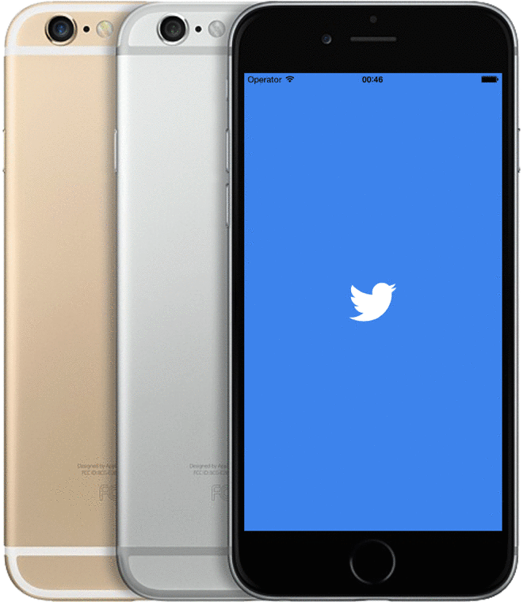
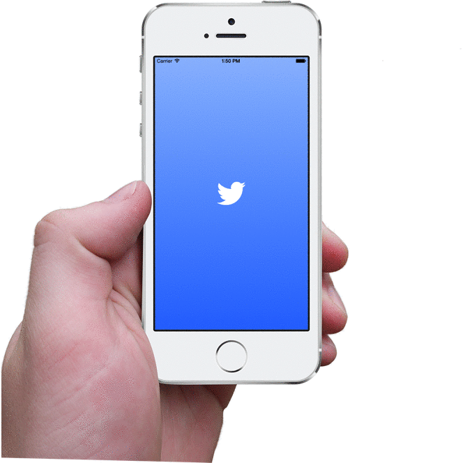

## MSTwitterSplashScreen for iOS App


[](https://cocoapods.org/pods/MSTwitterSplashScreen)
[](https://github.com/mateuszszklarek/MSTwitterSplashScreen/blob/master/LICENSE)
[](https://twitter.com/SzklarekMateusz)




**Twitter: <a href="https://twitter.com/SzklarekMateusz">@SzklarekMateusz</a>**
**Linkedin: <a href="https://www.linkedin.com/in/mateuszszklarek">Mateusz Szklarek</a>**
**E-mail: <mateusz.szklarek@icloud.com>**


The repository allows you to achieve the effect similar to one that you’ve probably seen on Twitter App.

## Features
* Compatible with iOS 7, 8 & 9
* Same size of logo among all iPhone models(4/4S,5/5S/5C,6/6+)
* Custom background and logo color
* Custom duration time of animation
* **Added possibility to create background with gradient!**

**All you need is:**

* Bézier curve of your logo (if you don’t know how to create it, feel free to let me know)

## How to use it?

###Import `MSTwitterSplashScreen` to your ViewController.m

```obj-c 
<MSTwitterSplashScreen/MSTwitterSplashScreen.h>
```

###Create property in interface ViewController.m

```obj-c
@property (strong, nonatomic) MSTwitterSplashScreen *splashScreen;
```

###Create object of class `MSTwitterSplashScreen`

```obj-c 
MSTwitterSplashScreen *twitterSplashScreen = ...
```

### and initialize the created object via public constructor 

You need to provide 3 parameters:

`bézierPath`

`backgroundColor` or `topColor` and `bottomColor` for background with gradient

`logoColor`

<pre><code>... = [[MSTwitterSplashScreen alloc] initSplashScreenWithBezierPath:bezierPath
													backgroundColor:backgroundColor
													      logoColor:logoColor];</code></pre> 


<pre><code>... = [[MSTwitterSplashScreen alloc] initSplashScreenWithBezierPath:bezierPath
								 backgroundWithGradientFromTopColor:topColor
												        bottomColor:bottomColor
												          logoColor:logoColor];</code></pre>                                                                              

### Determine duration of the animation

```obj-c 
splashScreen.durationAnimation = 1.8f;
```
### Add your `splashScreen` to view as subview

```obj-c
[self.view addSubview:splashScreen];
```
and assign it to property

```obj-c
self.splashScreen = splashScreen;
```

### Call method `startAnimation` in `viewDidAppear:(BOOL)animated`

```obj-c
- (void)viewDidAppear:(BOOL)animated
{
	[self.twitterSplashScreen startAnimation];
}
```

##How to install

You can integrate `MSTwitterSplashScreen` with your project using Cocoapods. Add the following line to your `*.podfile`. I recommend you to use the latest version which is still being developed.

You can install the library using CocoaPods. To do so, you will need to add one of the following lines to your Podfile:

    pod 'MSTwitterSplashScreen', '~> 1.0.6'

Which creates dependency for version `>= 1.0.6` and `< 1.1`

For most recent or exact development version (not recommended on production):

    pod 'MSTwitterSplashScreen', :git => 'https://github.com/mateuszszklarek/MSTwitterSplashScreen.git', :tag => 'v1.0.6'

##Inspired by

Pod is a simple modification of an existing pod `CBZSplashView` which I needed for one of my ongoing projects. Thanks a lot to [Callum Boddy](https://github.com/callumboddy) for giving me a possibility to modify his pod.

## License

The MIT License (MIT) - check included [LICENSE](LICENSE) file